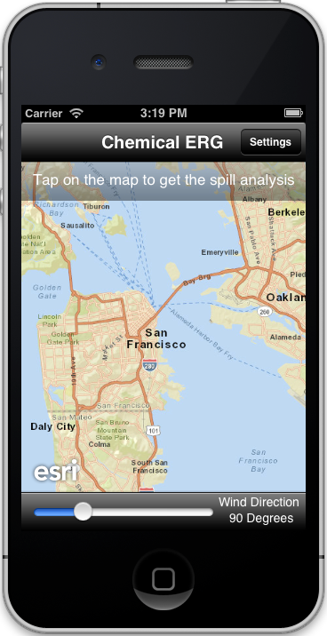
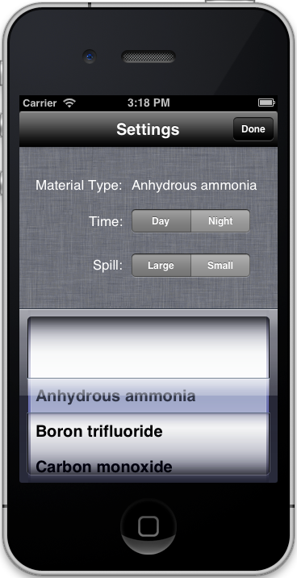
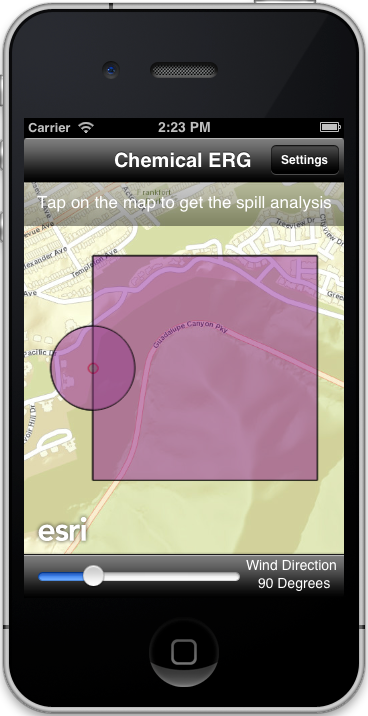

##Asynchronous Geoprocessing Sample 

This sample demonstrates how to perform analysis using ArcGIS Geoprocessing services.
You can specify a location on the map and find out areas that could
potentially be impacted by the spillage of hazardous material. You change settings such as 
wind direction, material type, time or extent of spill to see how the results change.

###The sample shows you how to
- use the  `AGSGeoprocessor` class to submit a geoprocessing job to
the service. The samples uses the Chemical Emergency Resource Guide geoprocessing service 
(http://sampleserver2.arcgisonline.com/ArcGIS/rest/services/PublicSafety/EMModels/GPServer/ERGByChemical).
- poll the service to check if the job is completed
- display result graphics on the map using `AGSGraphic` objects once the job completes 

###How to use the sample
1. Tap on any location on the map to perform the analysis.
2. Optionally, change settings such as the wind direction, material type, time or extent of spill.

