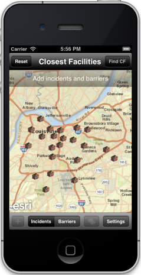
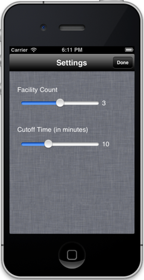
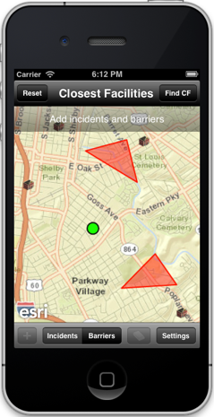

##Closest Facility Sample 

This sample shows how to find facilities that are closest to an incident on a map.
For example, finding the hospital that is closest to the scene of an accident.

###Usage
1. Tap on any location on the map, and then tap on the "+" button to add an incident on the map.
2. Repeat to add more incidents. 
3. Tap on the "Settings" button if you want to modify the number of facilities to find or the maximum cutoff value for each facility.
4. Tap on the "Barriers" button if you want to specify areas through which travel is not permitted (for example, in the event of flooding). Sketch a polygon by tapping at different locations on the map, and then tap on the "+" button.
5. Tap on the "Find CF" button to find the closest facility.
6. Use the "Reset" button to start over. 

###How the sample works
The sample uses the  AGSClosestFacility class in the API to perform the analysis.  The results of the analysis are displayed as routes to the selected facilities using an AGSGraphicsLayer. The sample uses AGSSketchGraphicsLayer to allow a user to interactively add incidents and barriers on the map as points and polygons.
