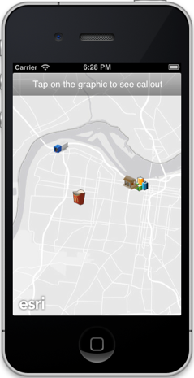
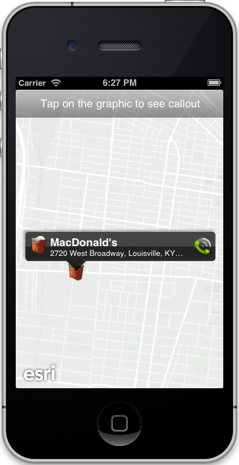
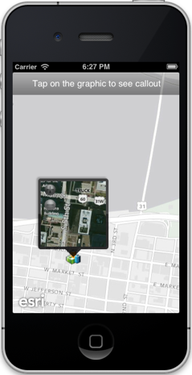

##Custom Callout Sample

This sample shows how you can display information about features on a map in callout.
 

###Using the app
1. Tap on the graphics on the map to display the callout. Notice that callout is different for each graphic.

###How it works
The sample adds 4 graphics (`AGSGraphic`) on a map using a graphics layer (`AGSGraphicsLayer`).  It sets properties on the callout (`AGSCallout`) to modify text, image, accessory button, and embed custom views to display an overview map or a web page.

