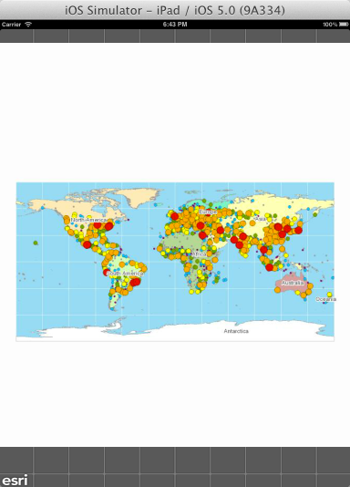

##Custom Tiled Layer Sample 

This sample shows how to implement a custom tiled layer. The layer is designed to grab map tiles that are included in the application bundle.

###How the sample works
The custom layer subclasses the AGSTiledServiceLayer class. It reads the metadata files in the cache (conf.xml and conf.cdi) that is included with the application. Based on the metadata, the layer sets some initial values for properties such as envelope, spatial reference, tiling scheme etc. Based on these values, the map requests tiles from the layer. The layer retrieves tiles from the local cache based on the parameters passed in by the map and then passes the tile images back to the map. 

