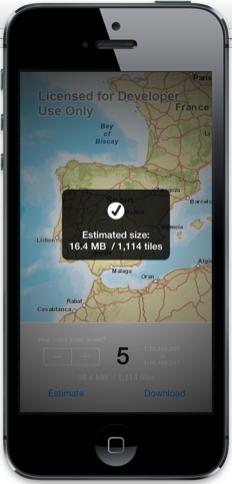
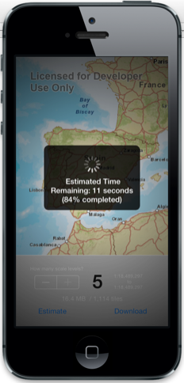
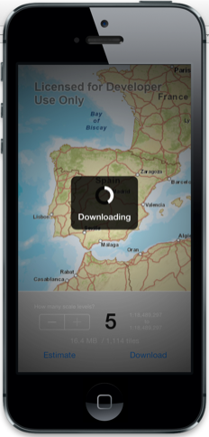

##Download Tile Cache Sample 

This sample shows how to extract a tile package for offline use from a supporting ArcGIS map service. This sample uses a [modified World Street Map service](http://sampleserver6.arcgisonline.com/arcgis/rest/services/World_Street_Map/MapServer) containing only a few scale levels for demo purposes. If you have subscription to ArcGIS online, you can download tiles from ArcGIS Online Basemaps on  [tiledbasemaps.arcgis.com](http://tiledbasemaps.arcgis.com)

###Using the sample
1. Zoom into an area for which you want to download tiles.
2. Specify how many scale levels you want to download by tapping on the **+** button. You will see  details about the scale range selected based on the number of levels you specify. The range starts from the map's current scale and can potentially go up to the maximum allowed by the layer. 
3. Tap on the **Estimate** to get an estimate of how large the cache might be.
4. Tap on the **Download** button to download the tiles. When the download completes the tile cache will be loaded in the map.

