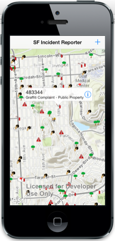
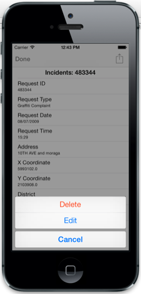
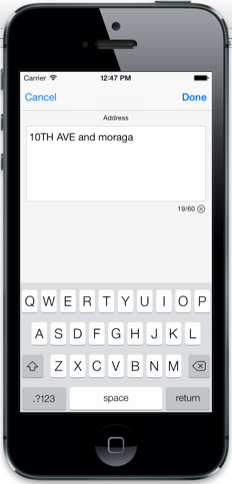
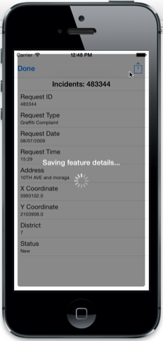

##Feature Layer Editing Sample

This sample demonstrates how you can edit geographic data in an ArcGIS Feature service. You can add new features with photo/video as attachment(s), or you can edit and delete existing features. 

###Using the app
1. Tap on any of the incidents displayed on the map. Tap on the callout accessory button to view details in a popup and make edits.
2. Tap on the action button in the top right, then choose **Edit**. Notice that popup shifts into edit mode. Tap on any of the attributes to make changes.
3. Tap on the Geometry or Attachment icons at the bottom of the popup to make changes to the feature's shape or edit attachments.
4. Tap on **Done** in the popup to save your edits.
5. Back on the map display, you can tap the **+** button in the top right to add a new feature. This displays a template picker. Choose a type of incident to add. A popup will display.
6. Specify attribute values for the feature. 
7. Tap on the Geometry icon on the bottom of the popup to specify where to add the feature to the map. Hit **Done** and save your edits.

###How the sample works
The sample opens a [web map](http://www.arcgis.com/home/item.html?id=b31153c71c6c429a8b24c1751a50d3ad) on www.ArcGIS.com which displays data of 311 Incident calls. The web map also contains popup definitions that describe how information about the 311 incidents should be displayed. When you tap on an incident, the sample uses AGSPopupsContainerViewController to display popup information about that feature in a callout. The popup allows edits to attributes, attachments, or geometry of the feature, and the edits are committed to the service using an AGSFeatureLayer and AGSAttachmentManager.