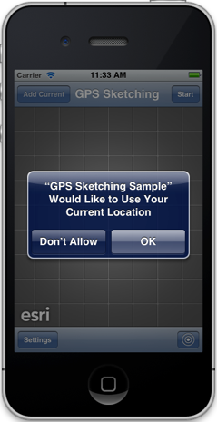
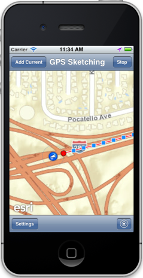
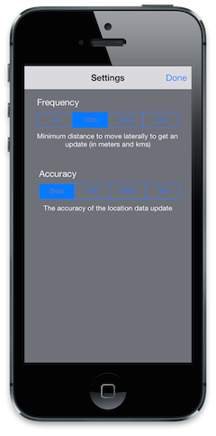

##GPS Sketching Sample 

This sample demonstrates how you can draw a sketch on a map based on the movement of the device and location  updates. You can add the current position as a vertex at any time. The sample allows you to configure the parameters for the location manager such as distance and accuracy to control when vertices are added to the sketch. 

It is best to run this sample on a device, but if you would like to test this on a simulator, go to Debug->Location in the iOS Simulator Menu and select either City Bicycle Ride, City Run or Freeway Drive. The location updates will be simulated for you. 

