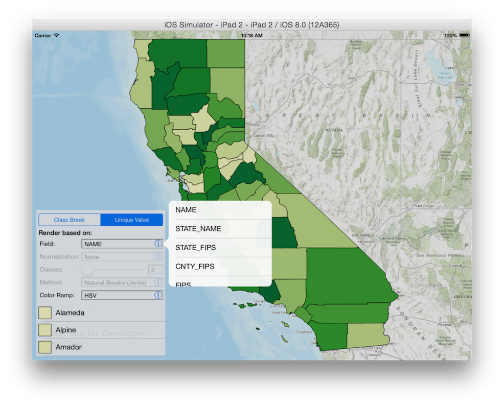

##Generate Renderer Sample

This sample demonstrates how you can generate class-breaks or unique-value renderers on-the-fly using the `AGSGenerateRendererTask` and then apply them on to a layer to change how its data is visulaized. The layer being used is an `AGSFeatureLayer` displaying the counties in California.

###Using the sample
1. Switch between the Class Break and Unique Value tabs to display the counties layer with different symbology. The symbols used are displayed in the legend.
2. Customize the renderer by adjusting settings such as the field on which the renderer is based, how the field values should be normalized, which color ramp algorithm to use, and how to classify the field values. The layer and legend is updated as you change the settings

###Using the API
The <code>MainViewController</code> contains an <code>AGSMapView</code> to display a map.
The map view contains an <code>AGSFeatureLayer</code> to display counties in California. The
view controller initializes a <code>LegendViewController</code> which does the heavy lifting of displaying different renderer settings, allowing the user to change those settings, and generating a renderer using the `AGSGenerateRendererTask` in response to user interaction. The renderer is then passed back to the `MainViewController` which updates teh feature layer with the newly generated renderer.
