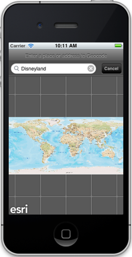
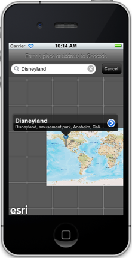
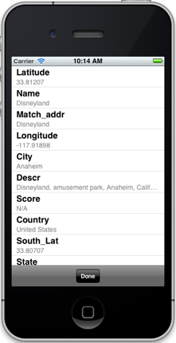

##Geocoding Sample 

This sample illustrates how you find locations and display them on a map using an ArcGIS Geocode service. This sample uses the [World Geocoding serivce](http://geocode.arcgis.com/arcgis/rest/services/World/GeocodeServer) on ArcGIS Online.

