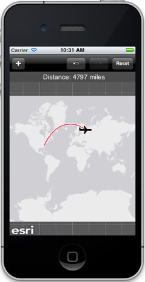
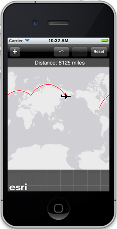
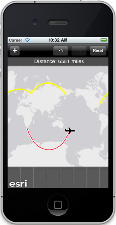

##Geodesic Sketching Sample 

This sample shows you how to draw geodesic lines using the geometry engine (`AGSGeometryEngine`) and a sketch layer (`AGSSketchGraphicsLayer`). Geodesic lines follow the surface of the earth and represent the shortest distance between points. You can sketch flight paths and get the true geodesic distance from departure point to destination. The sample can handle trips with multiple legs, and even trips across the dateline. You can undo and redo changes to the sketch.

