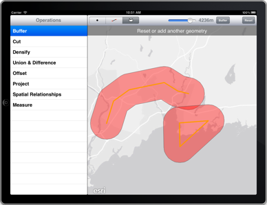
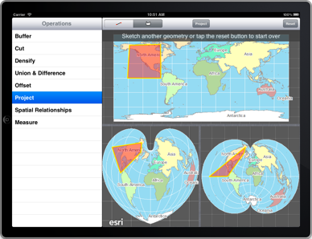

##Geometry Sample 

This sample uses the geometry engine (`AGSGeometryEngine`) in a myriad of ways to show off its diverse abilities.  There are nine operations explored in total: Buffer, Cut, Densify , Union, Difference, Offset, Project, Measure, and identification of Spatial Relationships. The sample allows you to sketch geometries using the sketch layer (`AGSSketchGraphicsLayer`) and modify them using each of the operations to see the effects.

Note, this sample exclusively targets the iPad because of its UI design. All the geometric operations are also available on the iPhone.

