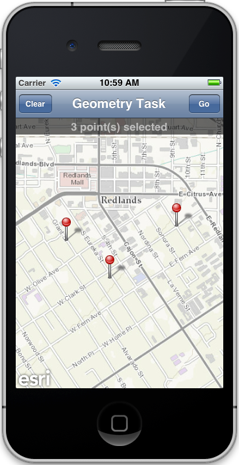
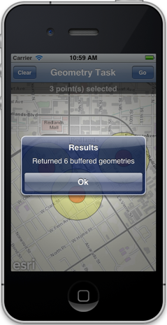
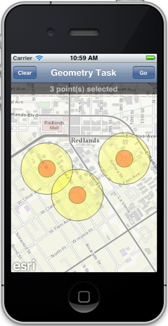

##Geometry Service Task Sample 

This sample illustrates how you can peform a buffer operation using an ArcGIS Geometry service and display the results on a map using graphics. It uses a [sample Geometry service](http://sampleserver3.arcgisonline.com/ArcGIS/rest/services/Geometry/GeometryServer) 

