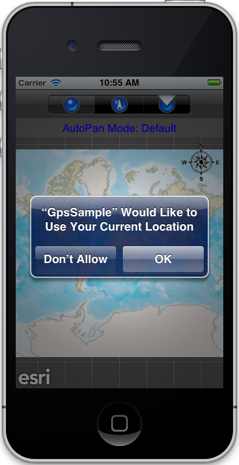
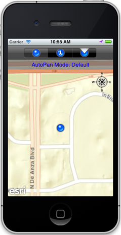
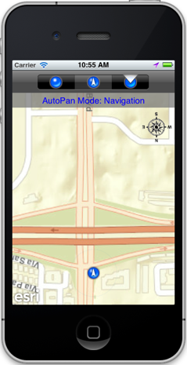

##Gps Sample 

This sample demonstrates how you can enable GPS functionality and display the device's location on the map. It also demonstrates the different autopan modes (Default, Navigation, and Compass Navigation) available with the map. To truly see the difference between these modes, you should run this sample on a device while walking or travelling in a vehicle.

