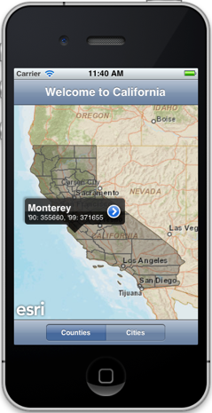
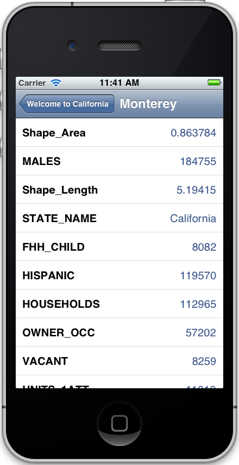
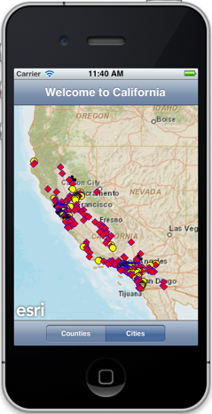

##Graphics Sample 

This sample illustrates how you can work with graphics layers in a map. The UISegmentedControl allows you to switch between graphics layers and display either counties or cities. The cities are symbolized differently depending upon their type (town, city, designated census place). You can tap on a county to display a callout and get more information about its attributes.

