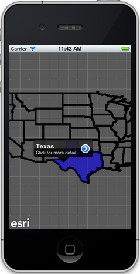
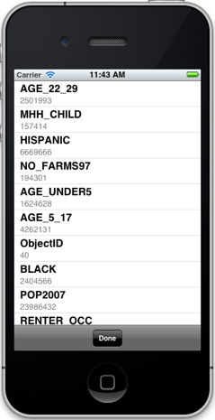

##Graphics Sample 

This sample illustrates how you can use the `AGSIdentifyTask` class to identify features in an ArcGIS Map service. You can tap on the map and display the result as a graphic with callout. You can click on the accessory view in the callout to see more information about the feature. This sample uses the [sample Demographics map service](http://sampleserver1.arcgisonline.com/ArcGIS/rest/services/Demographics/ESRI_Census_USA/MapServer)	

