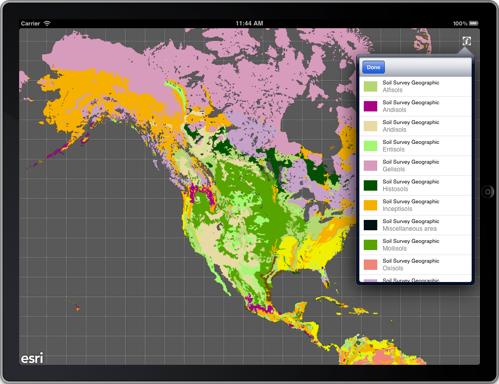

##Legend Sample 

This sample demonstrates how to display a legend for a map. The legend displays information for the following types of layers in the map -

- ArcGIS Tiled Map Service Layer 
- ArcGIS Dynamic Map Service Layer 
- ArcGIS Feature Layer

The Tiled and Dynamic Map Service Layers should be using services from ArcGIS Server 10 Service Pack 1 or greater.

