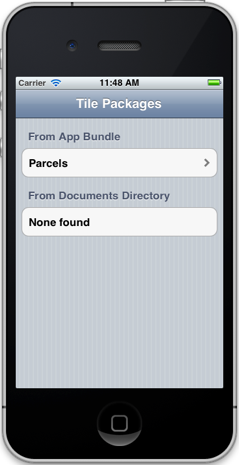
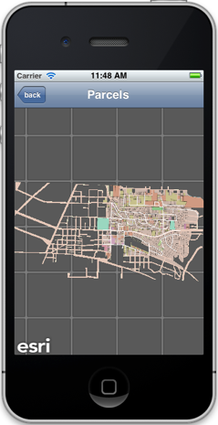

##Local Tiled Layer Sample 

This sample illustrates how to use tile packages and display maps even when the device does not have any network connectiviy.

The sample includes a tile package within the app bundle (Parcels.tpk). It also supports iTunes File Sharing. You can add tile packages through iTunes and the app will pick them up on launch. For more details about how to add a file to the iTunes app directory, please see [here](http://support.apple.com/kb/ht4094).

