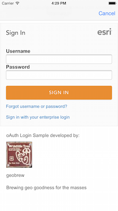
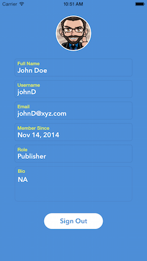

##OAuth Login Sample

This sample demonstrates how you can allow users to sign in to ArcGIS Online using OAuth 2.0. Upon signing in, the sample displays
the user's profile

###Using the sample
1. Tap on the <b>Sign in</b> button. This displays a new screen where you can sign in. 
2. Enter your ArcGIS Online credentials and sign in. 
3. Upon completion, the user's profile is displayed 
4. You can tap on the Sign Out button to go delete credential and go back to sign in view.
5. If you don't sign in step 2 above, you can hit <b>Cancel</b> to come back to the main screen. 
The sample does not allow you to view web maps unless you sign in.

 
 
 

###Using the API

The sample uses the class <code>AGSOAuthViewController</code> to handle the sign in process. 
When a user attempts to sign in,  <code>SignInViewController</code> instantiates an <code>AGSOAuthViewController</code> 
and displays it in a container view controller with a
Cancel button on the top right corner. When a user signs in successfully, the completion handler of <code>AGSOAuthViewController</code>
is invoked with an <code>AGSCredential</code> representing that user. The handler uses the credential to connect to a portal and then displays
the <code>ProfileViewController</code> to display the user's profile. 

