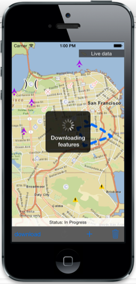
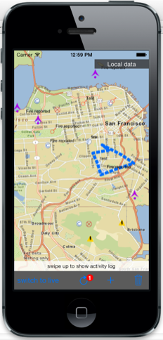
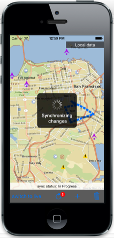

##Offline Feature Editing Sample (Beta)

This sample demonstrates how you can download features from a sync-enabled ArcGIS Feature Serivce, display and edit
the features even when the devices does not have any network connectivity, synchronize changes with the service
to push your edits up and pull down any changes from the service. The sample displays basemap tiles for downtown 
San Francisco using a tile package (.tpk file) so that the basemap is visible even when the device is offline.

**Note:** This sample uses functionality that is in beta at v10.2 of ArcGIS Runtime SDK for iOS.

###Using the sample
1. Upon startup, the app is in "Live Data" mode where the map displays features from an ArcGIS Feature service.
These features are refreshed every minute to ensure you can see any changes made on the service. The device needs a network connection
to ensure these features are displayed properly.
2. You can tap on any feature to view information about it in a popup. 
3. You can edit attributes, geometry, or attachments of the feature.
4. You can add new feature using the **+** button on the bottom toolbar.
5. Any edits you make while in "Live" mode are pushed immediately to the service.
6. You can tap the **download** button on the toolbar to download the features to the device.  The app moves into "Local Data" mode, the map displays features from the replica geodatabase on the deivce. You don't need any network connectivity to view or edit features in this mode.
7. You can tap on any feature to display information about it in a popup. 
8. You can edit attributes, geometry, or attachments of the feature.
9. Or you can add new feature using the **+** button on the bottom toolbar.
10. Any edits you make are held in the local geodatabase. These edits are displayed as a badge over the **Sync** button in the toolbar.
11. Assuming the device regains network connectivity, you can tap the **Sync** button to synchronize changes with the service. This will push your local edits up to the service
and bring down any changes from the service into your local geodatabase. 
12. After the sync completes, you can continue making edits in "Local" mode and synchronize as often as you like.
13. Tap the **switch to live** button when you're ready to start viewing live feature data from the service again. Your
local geodatabase is left intact in case you want to download features again.
14. Tap the **Delete** button to delete all local geodatabases that have been created.





###Using the API
The ```MainViewController``` contains an ```AGSMapView``` to display a map. The map contains ```AGSLocalTiledLayer``` to display basemap tiles from SanFrancisco.tpk tile package. 

In the "Live Data" mode, the map also contains ```AGSFeatureLayer``` for each layer in the [wildfire feature service](http://services.arcgis.com/P3ePLMYs2RVChkJx/arcgis/rest/services/Wildfire/FeatureServer)   to display features. These layers have ```expirationInterval``` property set to 60 seconds and ```autoRefreshOnExpiration``` enabled to refresh the feature data periodically. The ```editingDelegate``` of these layers is set to be the main view controller which applies any edits immediately to the service.

In the "Local Data" mode, the features are downloded from the service as a replica geodatabase using ```AGSGDBTask```. When the download completes, each dataset in the geodatabase accessed via ```AGSGDBFeatureTable``` and added to the map as an ```AGSFeatureTableLayer```. Features are  added, updated, or deleted using methods on ```AGSGDBFeatureTable``` and then later synchronized with the service using ```AGSGDBTask```
