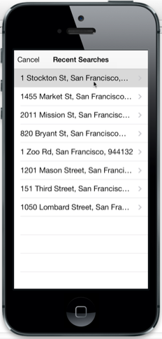
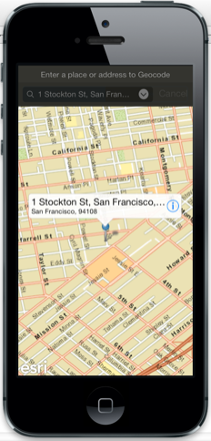
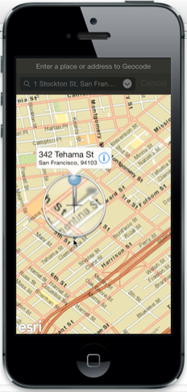

##Offline Geocoding Sample

This sample demonstrates how you can geocode addresses to locations and reverse geocode locations to addresses even when the device
does not have network connectivity. The sample  contains an address locator dataset (*.loc and associated files) that
contains address information for downtown San Francisco. Geocoding and Reverse geocoding operations use this data.
The sample displays basemap tiles using a tile package (.tpk file) so that the basemap
is visible even when the device is offline.

###Using the sample
1. Type an address in the search bar, or pick from a list of recent searches. 
2. The address will be displayed on the map with a pushpin symbol. 
3. Tap on the pushpin to display a callout for the result, and tap on the accessory button to see details.
4. Tap-and-hold anywhere on the map to bring up a magnifier. 
5. Move your finger on the map. The location underneath your finger
is reverse-geocoded and the address is displayed in a callout.

###Using the API
The <code>GeocodingSampleViewController</code> contains an <code>AGSMapView</code> to display a map.
The map view contains an <code>AGSLocalTiledLayer</code> to display tiles from SanFrancisco.tpk tile package. The
view controller initializes an <code>AGSLocator</code> with the SanFranciscoLocator.loc locator dataset to use for geocoding and reverse-geocoding.
The results are displayed as pushpin graphics using an <code>AGSGraphicsLayer</code>.
The map view's <code>touchDelegate</code> is used to track tap-and-hold gestures on the map and kick off reverse-geocoding operations.
