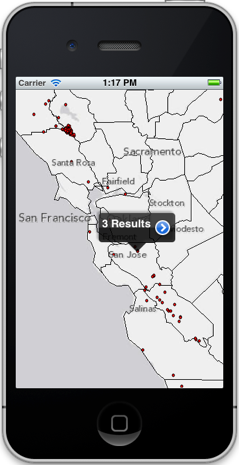
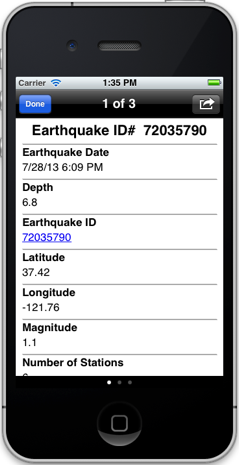
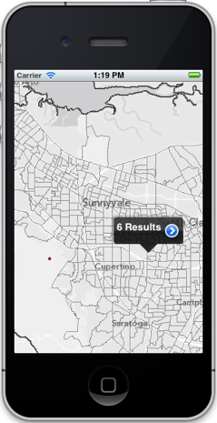
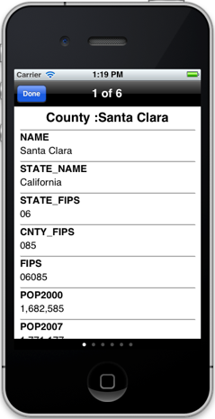

##Popup Sample 

This sample shows how to display popups configured in a webmap. Webmaps may be composed of a variety of different types of layers i.e. feature layers, map service layers, and image service layers. The logic to display popups for each of these layer types is provided in this sample. The sample also contains logic to query the backing service (if needed) to retrieve feature details that need to be display in the popup. The sample also honors scale dependency and visibility of layers when determining whether to display the popup or not for each layer.

