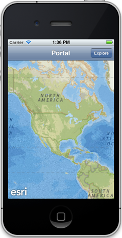
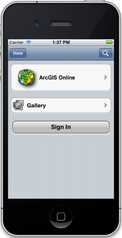
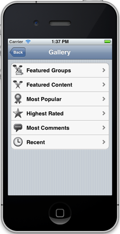
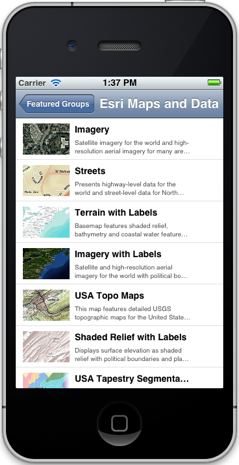

##Portal Explorer Sample 

This sample shows how to use `AGSPortal` and related classes to connect to and access content from portals such as ArcGIS Online. You can modify the sample to connect to on-premise portals or specific organization subscriptions on ArcGIS Online. You can either log in to the portal as a registered user or access the portal anonymously as a guest user (if the portal permits) 

