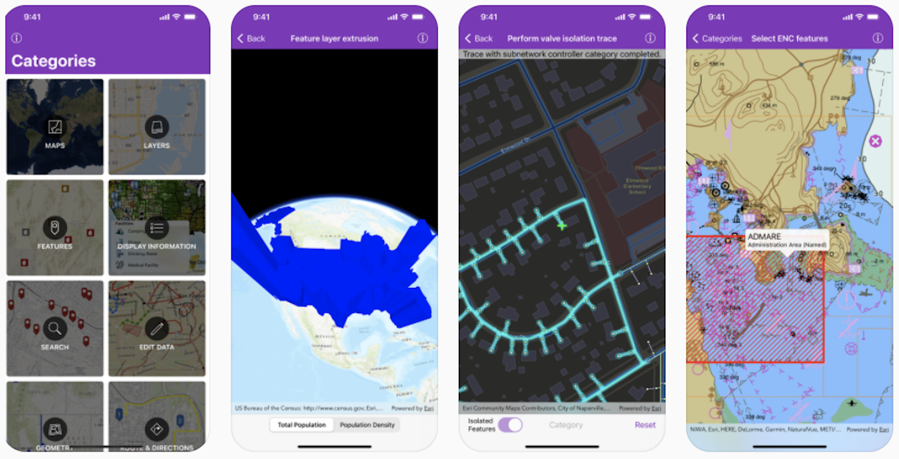

ArcGIS Runtime SDK for iOS Samples [](https://itunes.apple.com/us/app/arcgis-runtime-sdk-for-ios/id1180714771)
==========================

This repository contains Swift sample code demonstrating the capabilities of [ArcGIS Runtime SDK for iOS](https://developers.arcgis.com/ios/) and how to use them in your own app. The project can be opened in Xcode and run on a simulator or a device. Or you can [download the app from the App Store](https://itunes.apple.com/us/app/arcgis-runtime-sdk-for-ios/id1180714771) on your iOS device.



The ```main``` branch of this repository contains samples configured for the latest available version of ArcGIS Runtime SDK for iOS. For samples configured for older versions of the SDK, look under the [```Releases```](https://github.com/Esri/arcgis-runtime-samples-ios/releases) tab for a specific version.

## Features

* Maps - Open, create, interact with and save maps
* Layers - Display vector and raster data in maps and scenes
* Features - Work with feature layers and geodatabases
* Display Information - Show graphics, popups, callouts, and sketches
* Search - Find addresses, places, and points of interest
* Edit Data - Add, delete, and edit features and attachments
* Geometry - Create geometries and perform geometric operations
* Route & Directions - Calculate routes between locations and around barriers
* Analysis - Perform spatial analysis via geoprocessing tasks and services
* Cloud & Portal - Search for webmaps and list portal group users
* Scenes - Visualize 3D environments and symbols
* Utility Network - Work with utility networks, performing traces and exploring network elements
* Augmented Reality - View data overlaid on the real world through your device's camera

## Requirements

* [ArcGIS Runtime SDK for iOS](https://developers.arcgis.com/ios/) 100.11.0 (or newer)
* [ArcGIS Runtime Toolkit for iOS](https://github.com/Esri/arcgis-runtime-toolkit-ios) 100.11.0 (or newer)
* Xcode 12.0 (or newer)

The *ArcGIS Runtime SDK Samples app* has a *Target SDK* version of *13.0*, meaning that it can run on devices with *iOS 13.0* or newer.

## Building samples using installed SDK

1. **Fork** and then **clone** the repository
    > Make sure to use the "recursive" option to ensure you get the **ArcGIS Runtime Toolkit** submodule
    >
    >`git clone --recursive [URL to Git repo]`
    >
    > If you've already cloned the repo without the submodule, you can load the submodule using 
    >
    >`git submodule update --init`
1. **Install** the ArcGIS Runtime SDK for iOS to a central location on your Mac as described [here](https://developers.arcgis.com/ios/get-started)
1. **Open** the `arcgis-ios-sdk-samples.xcodeproj` **project** file
1. **Run** the `arcgis-ios-sdk-samples` app target
    > If you get the error message saying _"This Copy Files build phase contains a reference to a missing file 'ArcGISToolkit.framework'"_, you probably didn't clone the repo to include it's submodule. See Step 1 above.

## Building samples with CocoaPods

1. **Fork** and then **clone** the repository
1. **Install** the ArcGIS Runtime SDK for iOS by running the `pod install` command in the folder where you cloned this repository
1. **Open** the `arcgis-ios-sdk-samples.xcworkspace` **workspace** file
1. **Select** the `arcgis-ios-sdk-samples` project node, go to the `Build Phases` tab, and **delete** the phases for `Embed Frameworks`. (This phase conflicts with CocoaPods and is only required when using the installed SDK as described in the previous section)
1. **Select** the `ArcGISToolkit.xcodeproj` project node and **delete** it. (this project dependency conflicts with CocoaPods and is only required when using the installed SDK as described in the previous section)
1. **Run** the `arcgis-ios-sdk-samples` app target

## Sample Data

Some sample data is too large to store in the repository, so it is automatically downloaded at build time. The first time the app is built, a build script downloads the necessary data to `Portal Data`. The script only downloads data files that do not already exist, so subsequent builds will take significantly less time.

## Configure app secrets

As a best-practices principle, the project conceals app secrets from source code by generating and compiling an `AppSecrets.swift` source code file at build time using a custom build rule.

This build rule looks for a secrets file stored in the project's root directory, `$(SRCROOT)/.secrets`.

Note: Without licensing or licensing with invalid keys do not throw an exception, but simply fail to license the app, falling back to Developer Mode (which will display a watermark on the map and scene views).

1. Create a hidden secrets file in the project's root directory.

  ```bash
  touch .secrets
  ```

2. Add your **License Key** to the secrets file. Licensing the app will remove the 'Licensed for Developer Use Only' watermark. Licensing the app is optional in development but required for production. _Optionally_ add your **Extension License Key** and **API Key** to the secrets file if needed. Acquire license keys from your [dashboard](https://developers.arcgis.com/dashboard).

  ```bash
  echo ARCGIS_LICENSE_KEY=your-license-key >> .secrets
  echo ARCGIS_EXTENSION_LICENSE_KEY=your-extension-license-key >> .secrets
  echo ARCGIS_API_KEY=your-api-key >> .secrets
  ```

  > Replace 'your-license-key', 'your-extension-license-key' and 'your-api-key' with your keys.

3. Uncomment the line `application.license()` in `AppDelegate.application(_:didFinishLaunchingWithOptions:)`, and choose the appropriate licensing method for your keys.

Visit the developer's website to learn more about [Licensing your ArcGIS Runtime App](https://developers.arcgis.com/pricing/licensing/) and [Security and authentication](https://developers.arcgis.com/documentation/mapping-apis-and-location-services/security-and-authentication/).

To learn more about `masquerade`, consult the [documentation](https://github.com/Esri/data-collection-ios/tree/main/docs#masquerade) of Esri's Data Collection app.

## Additional Resources

* Want to start a new project? [Setup](https://developers.arcgis.com/ios/get-started) your dev environment
* New to the API? Explore the documentation : [Guide](https://developers.arcgis.com/ios/) | [API Reference](https://developers.arcgis.com/ios/api-reference/)
* Got a question? Ask the community on our [forum](https://community.esri.com/community/developers/native-app-developers/arcgis-runtime-sdk-for-ios/)

## Issues

Find a bug or want to request a new feature? Please let us know by submitting an issue.

## Contributing

Esri welcomes contributions from anyone and everyone. Please see our [guidelines for contributing](https://github.com/esri/contributing).

## Licensing

Copyright 2021 Esri

Licensed under the Apache License, Version 2.0 (the "License");
you may not use this file except in compliance with the License.
You may obtain a copy of the License at

   http://www.apache.org/licenses/LICENSE-2.0

Unless required by applicable law or agreed to in writing, software
distributed under the License is distributed on an "AS IS" BASIS,
WITHOUT WARRANTIES OR CONDITIONS OF ANY KIND, either express or implied.
See the License for the specific language governing permissions and
limitations under the License.

A copy of the license is available in the repository's [LICENSE](https://github.com/Esri/arcgis-runtime-samples-ios/blob/main/LICENSE) file.
