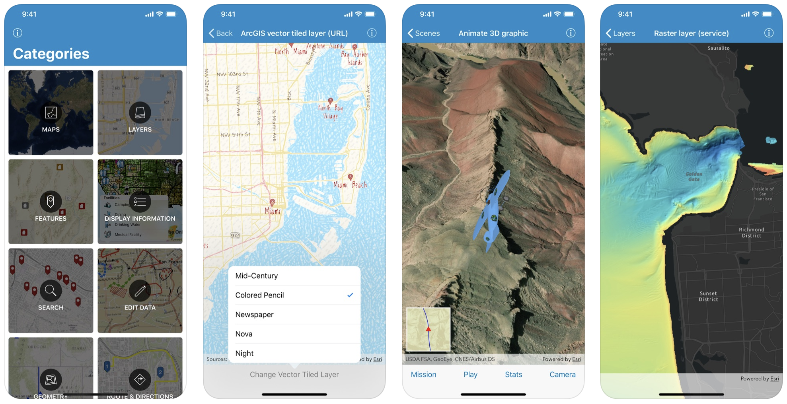

ArcGIS Runtime SDK for iOS Samples [](https://itunes.apple.com/us/app/arcgis-runtime-sdk-for-ios/id1180714771)
==========================

This repository contains Swift sample code demonstrating the capabilities of [ArcGIS Runtime SDK for iOS](https://developers.arcgis.com/ios/) and how to use them in your own app. The project that can be opened in Xcode and run on a simulator or a device. Or you can [download the app from the App Store](https://itunes.apple.com/us/app/arcgis-runtime-sdk-for-ios/id1180714771) on your iOS device.



The ```master``` branch of this repository contains samples configured for the latest available version of ArcGIS Runtime SDK for iOS. For samples configured for older versions of the SDK,  look under the ```Releases``` tab for a specific version.


## Features

* Maps - Open, create, inteact with and save maps
* Layers - Layer types offered by the SDK
* Features - Working with Feature layers
* Edit Data - Adding, deleting and editing features
* Display Information - Displaying graphics, popups and callouts
* Search - Finding an address
* Geometry - Displaying geometries
* Route & Directions - Find a route around barriers and get turn-by-turn directions
* Scenes - Display scenes, 3D symbols, and scene layers

## Requirements

* [ArcGIS Runtime SDK for iOS](https://developers.arcgis.com/ios/) 100.7.0 (or newer)
* [ArcGIS Runtime Toolkit for iOS](https://github.com/Esri/arcgis-runtime-toolkit-ios) 100.7.0 (or newer)
* Xcode 11.0 (or newer)

The *ArcGIS Runtime SDK Samples app* has a *Target SDK* version of *11.0*, meaning that it can run on devices with *iOS 11.0* or newer.

## Building samples using installed SDK
1. **Fork** and then **clone** the repository
    > Make sure to use the "recursive" option to ensure you get the **ArcGIS Runtime Toolkit** submodule
    >
    >`git clone --recursive [URL to Git repo]`
    >
    > If you've already cloned the repo without the submodule, you can load the submodule using 
    >
    >`git submodule update --init`
1. **Install** the ArcGIS Runtime SDK for iOS to a central location on your mac as described [here](https://developers.arcgis.com/ios/latest/swift/guide/install.htm#ESRI_SECTION1_D57435A2BEBC4D29AFA3A4CAA722506A)  
1. **Open** the `arcgis-ios-sdk-samples.xcodeproj` **project** file
1. **Run** the `arcgis-ios-sdk-samples` app target
    > If you get the error message saying _"This Copy Files build phase contains a reference to a missing file 'ArcGISToolkit.framework'"_, you probably didn't clone the repo to include it's submodule. See Step 1 above.

## Building samples with cocoapods
1. **Fork** and then **clone** the repository
1. **Install** the ArcGIS Runtime SDK for iOS by running the `pod install` command in the folder where you cloned this repository.
1. **Open** the `arcgis-ios-sdk-samples.xcworkspace` **workspace** file
1. **Select** the `arcgis-ios-sdk-samples` project node, go to the `Build Phases` tab, and **delete** the phases for `Embed Frameworks` and `Strip Frameworks` (these phases conflict with cocoapods  and are only required when using the installed SDK as described in the previous section )
1. **Select** the `ArcGISToolkit.xcodeproj` project node and **delete** it. (this project dependency conflicts with cocoapods and is only required when using the installed SDK as described in the previous section)
1. **Run** the `arcgis-ios-sdk-samples` app target


## Sample Data

Some sample data is too large to store in the repository, so it is automatically downloaded at build time. The first time the app is built, a build script downloads the necessary data to `Portal Data`. The script only downloads data files that do not already exist, so subsequent builds will take significantly less time.

## Additional Resources

* Want to start a new project? [Setup](https://developers.arcgis.com/ios/latest/swift/guide/install.htm) your dev environment
* New to the API? Explore the documentation : [Guide](https://developers.arcgis.com/ios/latest/swift/guide/introduction.htm) | [API Reference](https://developers.arcgis.com/ios/latest/api-reference/)
* Got a question? Ask the community on our [forum](https://geonet.esri.com/community/developers/native-app-developers/arcgis-runtime-sdk-for-ios/)

## Issues

Find a bug or want to request a new feature?  Please let us know by submitting an issue.

## Contributing

Esri welcomes contributions from anyone and everyone. Please see our [guidelines for contributing](https://github.com/esri/contributing).

## Licensing

Copyright 2013 Esri

Licensed under the Apache License, Version 2.0 (the "License");
you may not use this file except in compliance with the License.
You may obtain a copy of the License at

   http://www.apache.org/licenses/LICENSE-2.0

Unless required by applicable law or agreed to in writing, software
distributed under the License is distributed on an "AS IS" BASIS,
WITHOUT WARRANTIES OR CONDITIONS OF ANY KIND, either express or implied.
See the License for the specific language governing permissions and
limitations under the License.

A copy of the license is available in the repository's [license.txt]( https://raw.github.com/Esri/arcgis-runtime-samples-ios/master/license.txt) file.
