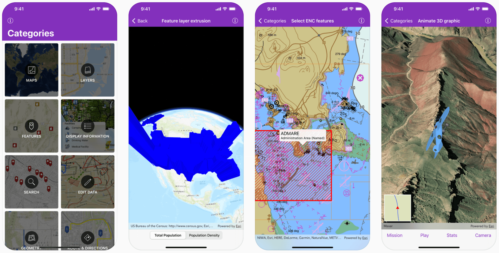

ArcGIS Runtime SDK for iOS Samples [](https://itunes.apple.com/us/app/arcgis-runtime-sdk-for-ios/id1180714771)
==========================

This repository contains Swift sample code demonstrating the capabilities of [ArcGIS Runtime SDK for iOS](https://developers.arcgis.com/ios/) and how to use them in your own app. The project can be opened in Xcode and run on a simulator or a device. Or you can [download the app from the App Store](https://itunes.apple.com/us/app/arcgis-runtime-sdk-for-ios/id1180714771) on your iOS device.



The ```main``` branch of this repository contains samples configured for the latest available version of ArcGIS Runtime SDK for iOS. For samples configured for older versions of the SDK, look under the [```Releases```](https://github.com/Esri/arcgis-runtime-samples-ios/releases) tab for a specific version.

## Features

* [Maps](arcgis-ios-sdk-samples/Maps) - Open, create, interact with and save maps
* [Layers](arcgis-ios-sdk-samples/Layers) - Display vector and raster data in maps and scenes
* [Features](arcgis-ios-sdk-samples/Features) - Work with feature layers and geodatabases
* [Display Information](arcgis-ios-sdk-samples/Display%20information) - Show graphics, popups, callouts, and sketches
* [Search](arcgis-ios-sdk-samples/Search) - Find addresses, places, and points of interest
* [Edit Data](arcgis-ios-sdk-samples/Edit%20data) - Add, delete, and edit features and attachments
* [Geometry](arcgis-ios-sdk-samples/Geometry) - Create geometries and perform geometric operations
* [Route & Directions](arcgis-ios-sdk-samples/Route%20and%20directions) - Calculate routes between locations and around barriers
* [Analysis](arcgis-ios-sdk-samples/Analysis) - Perform spatial analysis via geoprocessing tasks and services
* [Cloud & Portal](arcgis-ios-sdk-samples/Cloud%20and%20portal) - Search for webmaps and list portal group users
* [Scenes](arcgis-ios-sdk-samples/Scenes) - Visualize 3D environments and symbols
* [Utility Network](arcgis-ios-sdk-samples/Utility%20network) - Work with utility networks, performing traces and exploring network elements
* [Augmented Reality](arcgis-ios-sdk-samples/Augmented%20reality) - View data overlaid on the real world through your device's camera

## Requirements

* [ArcGIS Runtime SDK for iOS](https://developers.arcgis.com/ios/) 100.14.0 (or newer)
* [ArcGIS Runtime Toolkit for iOS](https://github.com/Esri/arcgis-runtime-toolkit-ios) 100.14.0 (or newer)
* Xcode 13.0 (or newer)

The *ArcGIS Runtime SDK Samples app* has a *Target SDK* version of *13.0*, meaning that it can run on devices with *iOS 13.0* or newer.

## Building Samples Using Swift Package Manager

1. **Fork** and then **clone** the repository
1. **Open** the `arcgis-ios-sdk-samples.xcodeproj` **project** file
    > The project has been configured to use the `arcgis-runtime-toolkit-ios` package, which provides the `ArcGISToolkit` framework as well as the `ArcGIS` framework.
1. **Run** the `arcgis-ios-sdk-samples` app target

> To add the Swift packages to your own projects, consult the documentation for the [ArcGIS Runtime iOS Toolkit](https://github.com/Esri/arcgis-runtime-toolkit-ios/#swift-package-manager) and [ArcGIS Runtime iOS SDK](https://github.com/Esri/arcgis-runtime-ios/#instructions).

## Building Samples Using CocoaPods

1. **Fork** and then **clone** the repository
1. **Install** the ArcGIS Runtime SDK for iOS by running the `pod install` command in the folder where you cloned this repository
1. **Open** the `arcgis-ios-sdk-samples.xcworkspace` **workspace** file
1. **Select** the `arcgis-ios-sdk-samples` project node, go to the `Package Dependencies` tab, and **delete** the `arcgis-runtime-toolkit-ios` package
    > This Swift package conflicts with CocoaPods and is only required when using the Swift Package Manager as described in the previous section.
1. **Run** the `arcgis-ios-sdk-samples` app target

## Building Samples Using Installed SDK

1. **Fork** and then **clone** the repository
1. **Install** the ArcGIS Runtime SDK for iOS to a central location on your mac as described [here](https://developers.arcgis.com/ios/install-and-set-up/#manual-download)
1. **Open** the `arcgis-ios-sdk-samples.xcodeproj` **project** file. **Select** the `arcgis-ios-sdk-samples` project node, go to the `Package Dependencies` tab, and **delete** the `arcgis-runtime-toolkit-ios` package
    > This Swift package conflicts with manual installation and is only required when using the Swift Package Manager as described in the previous section.
1. **Download** the `arcgis-runtime-toolkit-ios` from [here](https://github.com/Esri/arcgis-runtime-toolkit-ios), and follow the [instructions](https://github.com/Esri/arcgis-runtime-toolkit-ios#manual) to add it as a local Swift package
    > The manual installation method allows you to use a local installation ArcGIS Runtime SDK for iOS by making minor edits to the toolkit's Swift package manifest. Follow the instructions in `Package.swift` to uncomment the lines for `localArcGISPackage` and use it as the package dependency instead of the hosted version.
1. **Run** the `arcgis-ios-sdk-samples` app target

## Sample Data

Some sample data is too large to store in the repository, so it is automatically downloaded at build time. The first time the app is built, a build script downloads the necessary data to `Portal Data`. The script only downloads data files that do not already exist, so subsequent builds will take significantly less time.

## Configure API key

To build this app locally, follow the steps to add an API key to a secrets file stored in the project's root directory, `$(SRCROOT)/.secrets`.

1. Create a hidden secrets file in the project's root directory.

  ```bash
  touch .secrets
  ```

2. Add your **API Key** to the secrets file aforementioned. Adding an API key allows you to access a set of ready-to-use services, including basemaps. Acquire the keys from your [dashboard](https://developers.arcgis.com/dashboard). Visit the developer's website to learn more about [API keys](https://developers.arcgis.com/documentation/mapping-apis-and-services/security/api-keys/).

  ```bash
  echo ARCGIS_API_KEY=your-api-key >> .secrets
  ```

  > Replace 'your-api-key' with your keys.

Please see [Configure App Secrets](Documentation/ConfigureAppSecrets.md) for adding license key and other details.

## Additional Resources

* Want to start a new project? [Setup](https://developers.arcgis.com/ios/get-started) your dev environment
* New to the API? Explore the documentation : [Guide](https://developers.arcgis.com/ios/) | [API Reference](https://developers.arcgis.com/ios/api-reference/)
* Got a question? Ask the community on our [forum](https://community.esri.com/community/developers/native-app-developers/arcgis-runtime-sdk-for-ios/)

## Issues

Find a bug or want to request a new feature? Please let us know by submitting an issue.

## Contributing

Esri welcomes contributions from anyone and everyone. Please see our [guidelines for contributing](https://github.com/esri/contributing).

## Licensing

Copyright 2021 Esri

Licensed under the Apache License, Version 2.0 (the "License");
you may not use this file except in compliance with the License.
You may obtain a copy of the License at

   http://www.apache.org/licenses/LICENSE-2.0

Unless required by applicable law or agreed to in writing, software
distributed under the License is distributed on an "AS IS" BASIS,
WITHOUT WARRANTIES OR CONDITIONS OF ANY KIND, either express or implied.
See the License for the specific language governing permissions and
limitations under the License.

A copy of the license is available in the repository's [LICENSE](https://github.com/Esri/arcgis-runtime-samples-ios/blob/main/LICENSE) file.
