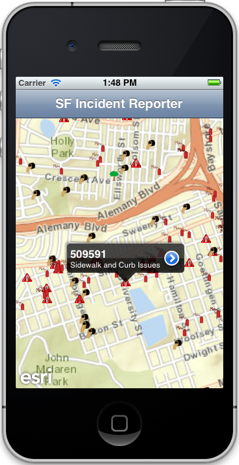
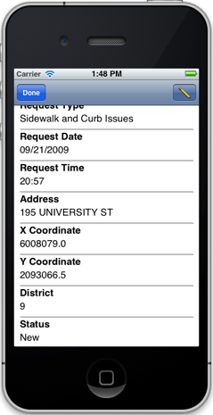
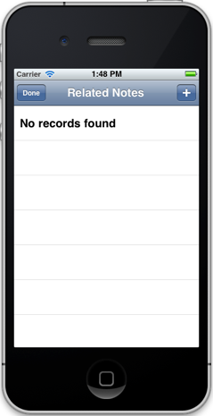
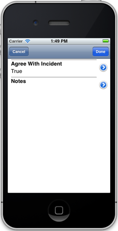
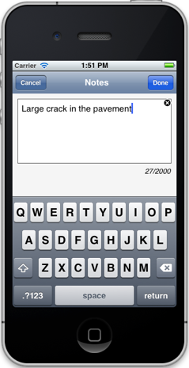
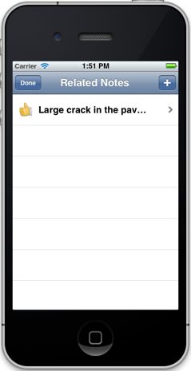

##Related Record Editing Sample 

This sample illustrates how to view and edit records that may be related to a feature. The sample uses the [San Francisco 311 incidents](http://sampleserver3.arcgisonline.com/ArcGIS/rest/services/SanFrancisco/311Incidents/FeatureServer) service. Users can tap on a an incident on a map and display information about it in a popup. They can also view, create, and edit related notes about the incident.

