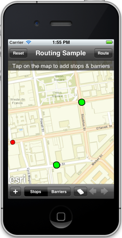
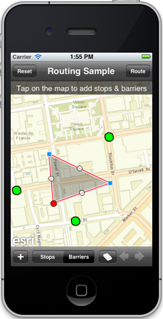

##Routing Editing Sample 

This sample demonstrates how to to calculate multi-point routes and driving directions. The sample allows a user to add stops interactively, and also barriers to avoid certain roads and intersections. Users can step through the directions turn-by-turn and see it highlighted on the map.

