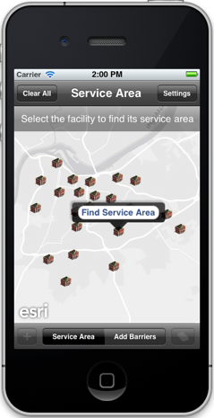
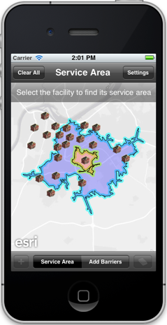
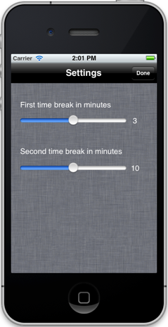

##Service Area Sample 

This sample shows how to compute service areas for a facility based on drive times. Users can add barriers to simulate restricted areas and specify different drive times to customize the results.

