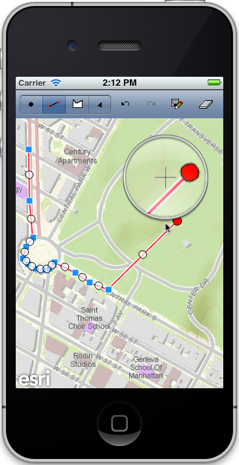
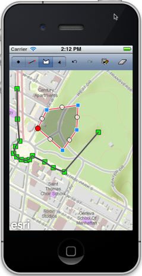

##Sketch Layer Sample 

This sample demonstrates how you can  allow users to create and modify geometries interactively. Users can sketch a shape, undo and redo changes to the sketch, save the final sketch as a new graphic in a graphics layer.

