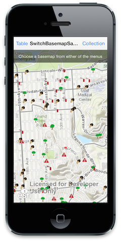
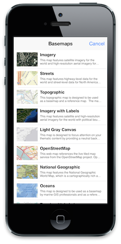
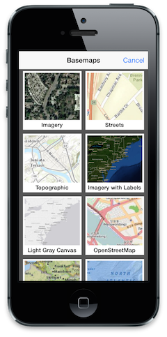

##Switch Basemap Sample 

This sample shows how to change the basemap for an `AGSWebMap`. It also provides a helper class (`PortalBasemapHelper`) to access basemaps from a portal.

###Usage
1. Tap on either the Table or Collection navigation bar item to view either a list or a collection of basemaps, respectively.
2. Choose one of the options.
3. The web map is loaded with the chosen option as the basemap.

###How the sample works
The sample uses the `-switchBaseMapOnMapView:basemap` method on `AGSWebMap` to load an alternate basemap for a given web map. The sample also includes a helper class to connect to a portal and access the basemaps in that portal. The helper class serves as the data source for both the collection view and the table view.
