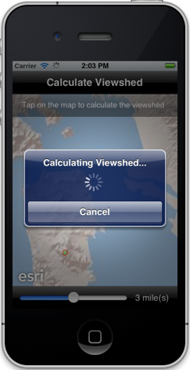
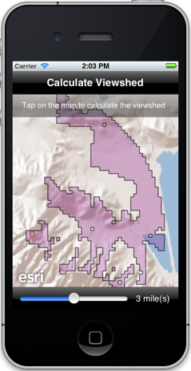

##Synchronous GP Sample 

This sample demonstrates how to execute a Geoprocessing task synchronously and wait for the task to get completed to retrieve the results. The results are provided back to the client as a AGSFeatureSet which is added as graphics to a graphics layer. The sample uses the [sample Viewshed GP Service](http://sampleserver1.arcgisonline.com/ArcGIS/rest/services/Elevation/ESRI_Elevation_World/GPServer/Viewshed) . 

