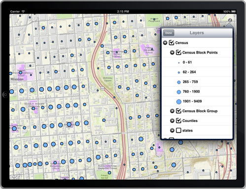

##Table Of Contents (TOC) Sample 

This sample allows the users to interact with the contents of a map. Users can view the layers in a tree structure, change visibilities of groups and layers, view the legend. 

