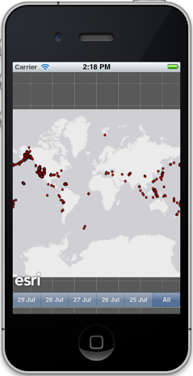
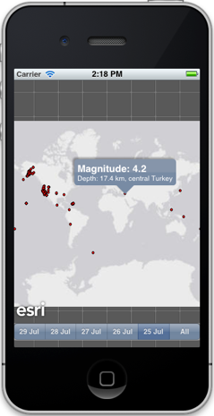
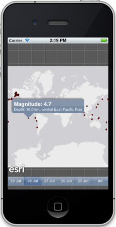

##Temporal Sample 

This sample uses a feature layer to display earthquakes from the past 5 days. You can pick a day to view only those earthquakes that occurred on that particular day.
The sample highlights the temporal capabilities by setting time extent on the map whenever a new day is picked. 

