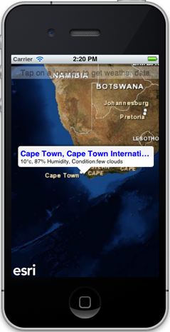

##Weather Info Sample 

This sample demonstrates how you can use the `AGSJSONRequestOperation` class to  invoke custom REST web services. The sample allows you to tap on a location to retrieve weather information for that location using [Geonames findNearbyWeatherJSON](http://www.geonames.org/export/JSON-webservices.html#findNearByWeatherJSON) web service. 

