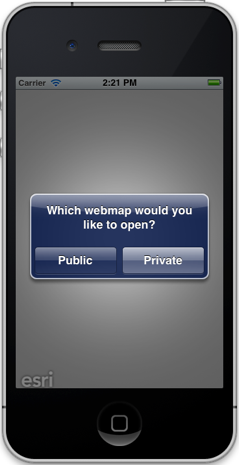
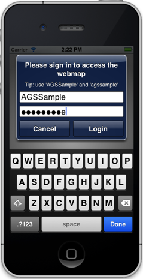
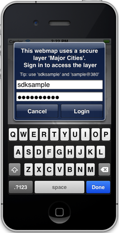

##Webmap Sample 

This sample demonstrates how to view a webmap from ArcGIS Online. The sample can handle different scenarios such as -

1) The webmap and its constituent layers are publicly accessible to everyone. 

2) The webmap is private and requires credentials to permit access. However, all webmap layers use publicly accessible services. 

3) The webmap is private. Some layers use secured services which can be accessed using the same credentails as the web map.

4) The webmap is private. Some layers use secured services which require a different set of credentials to permit access.


###Using the app
1. Choose the **Public** option (Scenario #1 above). The app will display the [London Underground]((http://www.arcgis.com/home/webmap/viewer.html?webmap=8a567ebac15748d39a747649a2e86cf4) web map.
2. Choose the **Private** option (Scenario #4 above). The sample will ask you to provide credentails to access the [US Cities](http://www.arcgis.com/home/webmap/viewer.html?webmap=9a5e8ffd9eb7438b894becd6c8a85751) web map.
3. Enter _AGSSample_ as the username, and _agssample_ as the password. Some layers in the web map will begin to appear.
4. The sample will then ask you to provide credentials to access the secured [Major Cities](http://mobilesampleserver.arcgisonline.com/ArcGIS/rest/services/SDKSamples/MajorCities/FeatureServer/0) layer.
5. Enter _sdksample_ as the username, and _sample@380_ as the password. The web map will be displayed.






###How it works
The ```WebMapSampleViewController``` contains an ```AGSMapView``` to display a map. The view controller instantiates an ```AGSWebMap``` using the ID of the webmap to load, and optionally an ```AGSCredential``` if the webmap is private and requires a credential to permit access. It calls ```[AGSWebMap openIntoMapView:]``` to open the web map. If a layer in the web map fails to load because of an authentication error, the view controller calls ```[AGSWebMap continueOpenWithCredential:]``` with the credentials provided by the user. If the layer fails to load because of other reasons, such as if the service is unavailable, the view controller calls ```[AGSWebMap continueOpenAndSkipLayer]``` to skip the current layer and proceed to next one.


