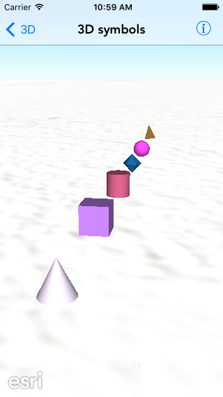

#3D symbols

This sample demonstrates how to create 3D symbols with different shapes.

##How it works

The sample creates a symbol for each `AGSSimpleMarkerSymbolStyle`, namely

- Cone
- Cube
- Cylinder
- Diamond
- Sphere
- Tetrahedron

It then creates a `AGSGraphic` for each of these symbols and adds that graphic to the graphics overlay. The graphics are placed absolutely i.e. at the height above sea level.