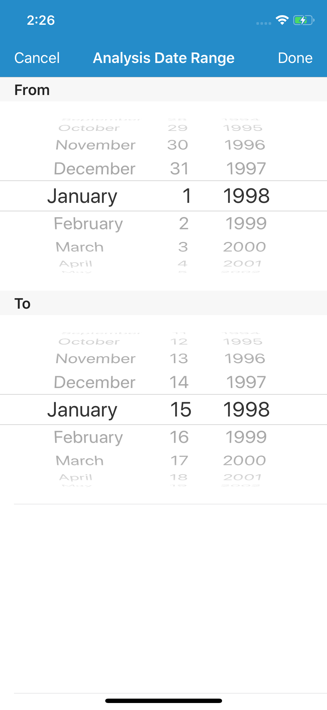
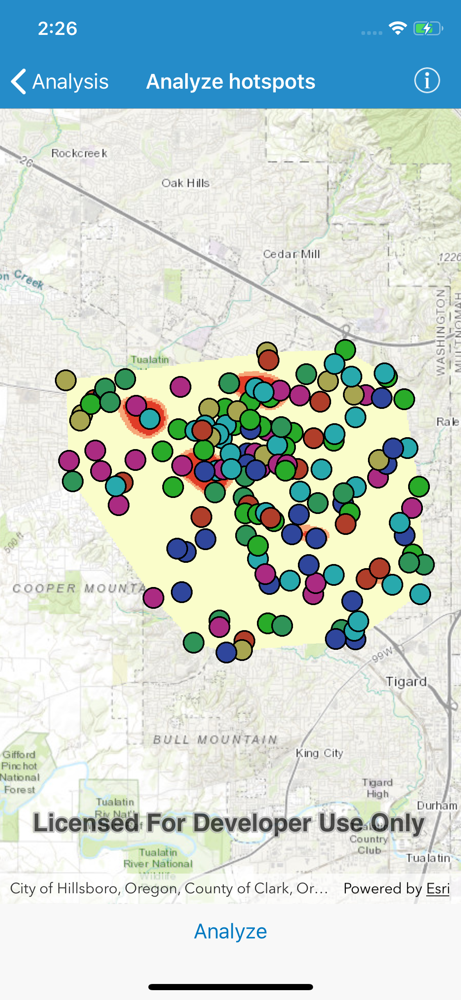

#Analyze hotspots

This sample demonstrates how to execute a geoprocessing task to calculate a hotspot analysis based on the frequency of 911 calls. It calculates the frequency of these calls within a given study area during a specified constrained time period set between 1/1/1998 and 5/31/1998.

##How to use the sample

To select a date range for analysis, tap on `Analyze` in the bottom toolbar. Pick `From` and `To` date and tap on `Done` button to start analysis (Tap anywhere on screen to hide the date picker). The results will be shown on the map on successful completion.

##How it works

An `AGSGeoprocessingTask` is created by setting the URL to the REST endpoint of a geoprocessing service. `AGSGeoprocessingParameters` are created and the execution type is set to `AsynchronousSubmit`. Once the date ranges are selected, a query string is created with the to and from dates. A key/value parameter input is created, where the key is the string `Query` and the value is an `AGSGeoprocessingString` that contains the query string. These parameter inputs are then added to the `AGSGeoprocessingParameters`. An `AGSGeoprocessingJob` is obtained by calling the `geoprocessingJob(with:)` method of the `AGSGeoprocessingTask`. The job is started, and once it is complete, the `AGSArcGISMapImageLayer` is obtained from the result, and added to the `AGSMap`.

