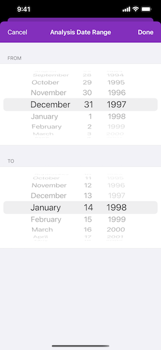

# Analyze hotspots

Use a geoprocessing service and a set of features to identify statistically significant hot spots and cold spots.

## Use case

This tool identifies statistically significant spatial clusters of high values (hot spots) and low values (cold spots). For example, a hotspot analysis based on the frequency of 911 calls within a set region.

## How to use the sample

Select a date range (between 1998-01-01 and 1998-05-31) from the dialog and tap on Analyze. The results will be shown on the map upon successful completion of the `AGSGeoprocessingJob`.

## How it works

1. Create an `AGSGeoprocessingTask` with the URL set to the endpoint of a geoprocessing service.
2. Create a query string with the date range as an input of `AGSGeoprocessingParameters`.
3. Use the `AGSGeoprocessingTask` to create an `AGSGeoprocessingJob` with the `AGSGeoprocessingParameters` instance.
4. Start the `AGSGeoprocessingJob` and wait for it to complete and return an `AGSGeoprocessingResult`.
5. Get the resulting `AGSArcGISMapImageLayer`.
6. Add the layer to the map's operational layers.

## Relevant API

* AGSGeoprocessingJob
* AGSGeoprocessingParameters
* AGSGeoprocessingResult
* AGSGeoprocessingTask

## Tags

analysis, density, geoprocessing, hot spots, hotspots
