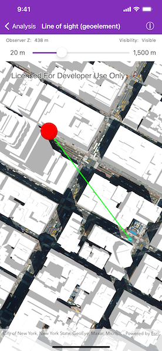

# Line of sight (geoelement)

Show a line of sight between two moving objects.

## Use case

A line of sight between `GeoElement`s (i.e. observer and target) will not remain constant whilst one or both are on the move.

A `GeoElementLineOfSight` is therefore useful in cases where visibility between two `GeoElement`s requires monitoring over a period of time in a partially obstructed field of view
(such as buildings in a city).

## How to use the sample

A line of sight will display between a point on the Empire State Building (observer) and a taxi (target).
The taxi will drive around a block and the line of sight should automatically update.
The taxi will be highlighted when it is visible. You can change the observer height with the slider to see how it affects the target's visibility.

## How it works

1. Instantiate an `AGSAnalysisOverlay` and add it to the `AGSSceneView`'s analysis overlays collection.
2. Instantiate an `AGSGeoElementLineOfSight`, passing in observer and target `GeoElement`s (features or graphics). Add the line of sight to the analysis overlay's analyses collection.
3. To get the target visibility when it changes, observe the target visibility changing on the `AGSGeoElementLineOfSight` instance.

## Relevant API

* AGSAnalysisOverlay
* AGSGeoElementLineOfSight
* AGSLineOfSight.TargetVisibility

## Offline data

[Taxi CAD](https://www.arcgis.com/home/item.html?id=3af5cfec0fd24dac8d88aea679027cb9) will be downloaded by the sample viewer automatically. Its local location is `<userhome>/ArcGIS/Runtime/Data/3D/dolmus\_3ds/dolmus.zip`

## Tags

3D, line of sight, visibility, visibility analysis
