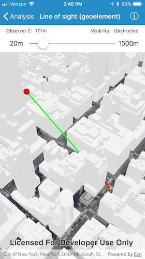

# Line of sight (geoelement)

This sample demonstrates how to perform a dynamic line of sight analysis between two moving GeoElements (an observer whose height above ground can be modified interactively, and a moving taxi).

## How to use the sample

Use the slider to adjust the height of the observer.

## How it works

An `AGSGeoElementLineOfSight` is created using the `init(observerLocation:targetLocation:)` initializer that takes observer and target geo-elements (in this case, `AGSGraphic` objects in an `AGSGraphicsOverlay` that's added to the scene view). As a result of the analysis, a line is rendered between the observer and target with green color representing visible segment and red color representing obstructed segment. An analysis overlay is used to render the results of visual analysis on the scene view.

The line width used to render analysis results is set using the `setLineWidth()` method on the base class for the line of sight analysis called `AGSLineOfSight`. This setting is applied to all line of sight analyses in the view.

The height of the observer above the ground is modified using a `UISlider` and the taxi's location is modified on a `Timer`. As the observer and taxi graphics are moved, the line of sight analysis automatically updates to reflect their positions.

