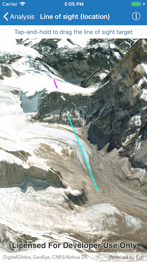

# Line of sight (location)

This sample demonstrates how to interactively place a line of sight between two locations.

## How it works

`AGSLocationLineOfSight` is created using the `init(observerLocation:targetLocation:)` initializer that takes observer and target locations. As a result of the analysis, a line is rendered between the observer and target with green color representing visible segment and red color representing obstructed segment. Analysis overlay is used to render the results of visual analysis on the scene view.

The line width used to render analysis results is set using the `setLineWidth()` method on the base class for the line of sight analysis called `AGSLineOfSight`. This setting is applied to all line of sight analyses in the view.

`AGSGeoViewTouchDelegate` is used for capturing user's interaction on map and updating the `observerLocation` and `targetLocation`. The observer location is set in the `geoView(_:didTapAtScreenPoint:mapPoint:)` method when user taps on the map. The target location is updated in the `geoView(_:didLongPressAtScreenPoint:mapPoint:)` method when user performs long-pressed gesture at a specified location and in the `geoView(_:didMoveLongPressToScreenPoint:mapPoint:)` method when user drags the target location during a long press interaction.
