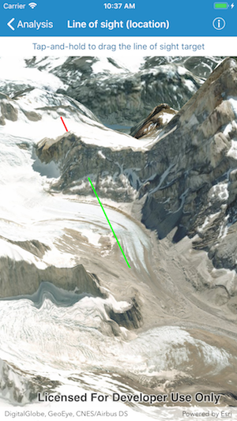

# Line of sight (location)

This sample demonstrates how to interactively place a line of sight between two locations.

## How it works

`AGSLocationLineOfSight` analysis provides an initializer called `init(observerLocation:targetLocation:)` that takes observer and target locations.

Once the `AGSLocationLineOfSight` is created, it is added to a collection of analysis overlays in the `AGSSceneView`. The analysis overlays are used to render the results of visual analysis on the scene view.

The sample uses `AGSGeoViewTouchDelegate` to capture user interaction on map and updates the `observerLocation` and `targetLocation` on the `AGSLocationLineOfSight` accordingly. The observer location is defined in the `geoView(_:didTapAtScreenPoint:mapPoint:)` method when user taps on the map. The target location is updated in `geoView(_:didLongPressAtScreenPoint:mapPoint:)` method when user performs long-pressed gesture at a specified location and in `geoView(_:didMoveLongPressToScreenPoint:mapPoint:)` method when user drags the target location during a long press interaction.

As a result of the analysis, a line is rendered between the observer and target with distinct colors representing visible and obstructed segments. The sample shows visible segment in cyan and obstructed segment in magenta.
