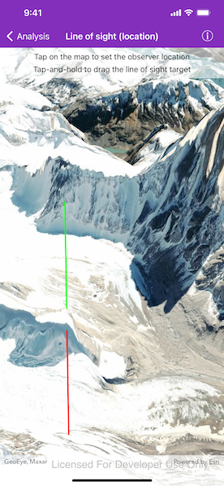

# Line of sight (location)

Perform a line of sight analysis between two points in real time.

## Use case

A line of sight analysis can be used to assess whether a view is obstructed between an observer and a target. Obstructing features could either be natural, like topography, or man-made, like buildings. Consider an events planning company wanting to commemorate a national event by lighting sequential beacons across hill summits or roof tops. To guarantee a successful event, ensuring an unobstructed line of sight between neighboring beacons would allow each beacon to be activated as intended.

## How to use the sample

Tap on the map to set the observer location. Tap and hold to drag the line of sight target. A red segment on the line means the view between observer and target is obstructed, whereas green means the view is unobstructed. 

## How it works

1. Create an `AGSAnalysisOverlay` and add it to the scene view.
2. Track the screen taps using the `AGSGeoViewTouchDelegate`. 
3. Create an `AGSLocationLineOfSight` with the map points.
4. Update the target location when needed.

## Relevant API

* AGSAnalysisOverlay
* AGSLocationLineOfSight
* AGSSceneView

## Tags

3D, line of sight, visibility, visibility analysis
