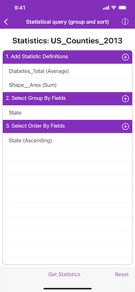
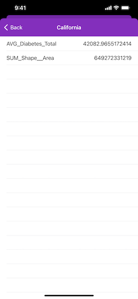

# Statistical query (group and sort)

Query a feature table for statistics, grouping and sorting by different fields.

 

## Use case

You can use statistical queries, grouping and sorting to process large amounts of data saved in feature tables. This is helpful for identifying trends and relationships within the data, which can be used to support further interpretations and decisions. For example, a health agency can use information on medical conditions occurring throughout a country to identify at-risk areas or demographics, and decide on further action and preventive measures.

## How to use the sample

Select a combination of fields and statistic types to include in the query. Choose one or more fields by which to group the results. For example, selecting "State" will calculate the results by state. Choose one or more fields to order results by. Only those fields selected for grouping are valid choices for ordering results. Swipe left to delete any selection. Tap the "Get Statistics" button to execute the query. Results will be displayed in a hierarchical view that is grouped and sorted according to the chosen fields. Tap "Reset" to clear the query.

## How it works

1. Create an `AGSServiceFeatureTable` using the URL of a feature service and load the table.
2. Create `AGSStatisticDefinition` objects and add them to the `AGSStatisticsQueryParameters`.
3. To have the results grouped by fields, add the field names to the query parameters' `groupByFieldNames` array.
4. To have the results ordered by fields, create `AGSOrderBy`s, specifying the field name and `AGSSortOrder`. Pass these `AGSOrderBy`s to the parameters' `orderByFields` collection.
5. To execute the query, call `AGSFeatureTable.queryStatistics(with:completion:)`.
6. Get the `AGSStatisticQueryResult`. From this, you can use `AGSStatisticsQueryResult.statisticRecordEnumerator()` to loop through and display.

## About the data

This sample uses a [Diabetes, Obesity, and Inactivity by US County](https://www.arcgis.com/home/item.html?id=392420848e634079bc7d0648586e818f) feature layer hosted on ArcGIS Online.

## Relevant API

* AGSField
* AGSOrderBy
* AGSQueryParameters
* AGSServiceFeatureTable
* AGSStatisticDefinition
* AGSStatisticRecord
* AGSStatisticsQueryParameters
* AGSStatisticsQueryResult
* AGSStatisticType

## Tags

correlation, data, fields, filter, group, sort, statistics, table
