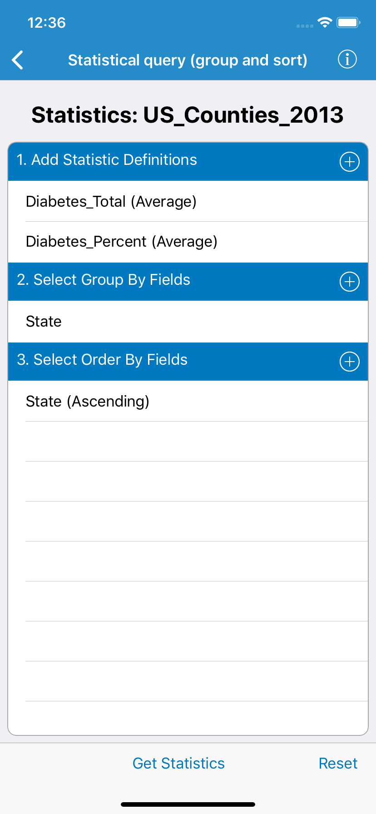

# Statistical query (group and sort)

This sample demonstrates how to query a feature table to get statistics for one or more specified fields.  The sample queries a service feature table of US states to get the selected statistics. The results can be grouped and sorted using one or more fields in the table.

## How to use the sample

- Select a combination of fields and statistic types to include in the query.
- Choose one or more fields to group the results on. Grouping by SUB_REGION, for example, will show results grouped (summarized) for each region ('Pacific', 'Mountain', etc).
- (Optional) Choose one or more fields to order results by. Only those fields selected for grouping are valid choices for ordering results.
- Execute the query. Results will be displayed in a hierarchical view that is grouped and sorted according to the chosen fields.

## How it works

An `AGSServiceFeatureTable` is created with a URL to the REST endpoint of a feature service. `AGSStatisticsQueryParameters` are created, and several `AGSStatisticDefinition` objects are created and added to the parameters. These definitions defines the various statistics that we would like to compute, such as average, minimum and maximum of a given field. One or more Group By and/or Order By fields are added to the parameters. When the button is clicked, `queryStatistics` is executed on the `AGSServiceFeatureTable`. Depending on the state of two switches, additional paramters are set. This process runs asynchronously, and once completed, returns `AGSStatisticsQueryResult`, which contains key/value pairs as the result.

