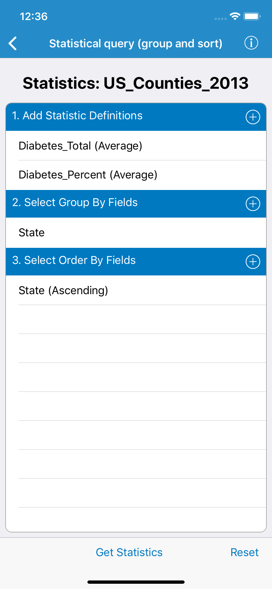
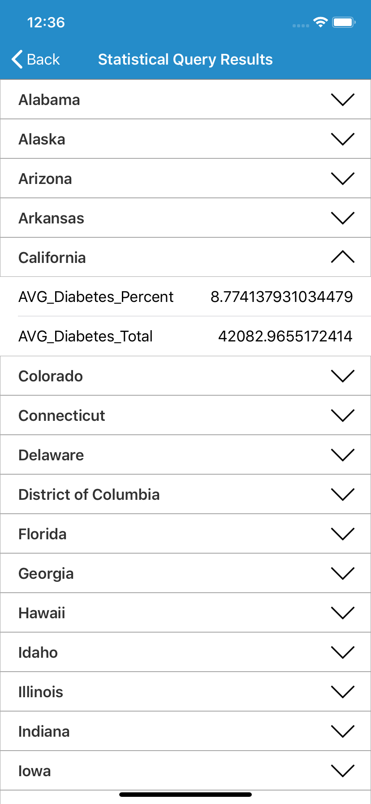

# Statistical query (group and sort)

This sample demonstrates how to query a feature table to get statistics
for one or more specified fields. The sample queries a service feature
table of U.S. county diabetes data to get the selected statistics. The
results can be grouped and sorted using one or more fields in the table.

## How to use the sample

  - Select a combination of fields and statistic types to include in the
    query.
  - Choose one or more fields by which to group the results. For
    example, selecting “State” will calculate the results by state.
  - (Optional) Choose one or more fields to order results by. Only those
    fields selected for grouping are valid choices for ordering results.
  - Execute the query. Results will be displayed in a hierarchical view
    that is grouped and sorted according to the chosen fields.

 

## How it works

An `AGSServiceFeatureTable` is created with a URL to the REST endpoint
of a feature service. `AGSStatisticsQueryParameters` are created, and
several `AGSStatisticDefinition` objects are created and added to the
parameters. These definitions defines the various statistics that we
would like to compute, such as average, minimum and maximum of a given
field. One or more Group By and/or Order By fields are added to the
parameters. When the button is clicked, `queryStatistics` is executed on
the `AGSServiceFeatureTable`. Depending on the state of two switches,
additional paramters are set. This process runs asynchronously, and once
completed, returns `AGSStatisticsQueryResult`, which contains key/value
pairs as the result.
