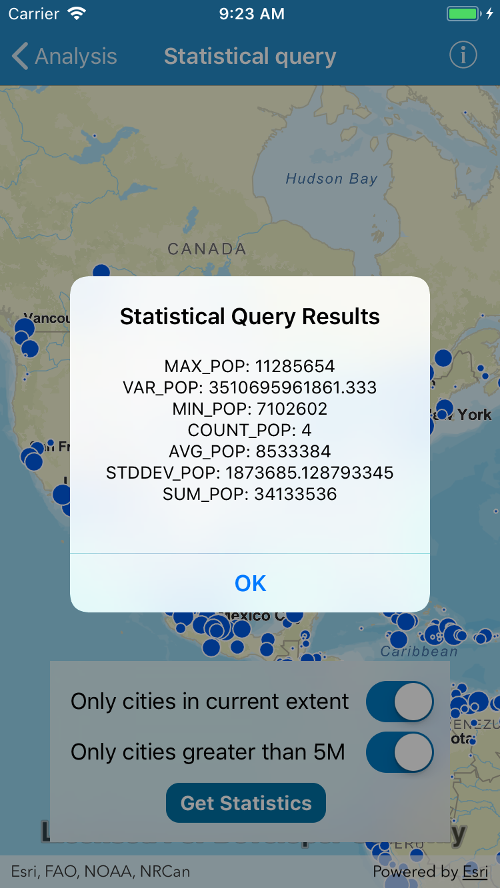

# Statistical query

This sample demonstrates how to query a feature table to get aggregated statistics back for a specific field.

## How to use the sample

Select the appropriate switch to filter features by attributes and/or within the current extent. Click the button to see basic statistics displayed for world cities.

## How it works

An `AGSServiceFeatureTable` is created with a URL to the REST endpoint of a feature service. `AGSStatisticsQueryParameters` are created, and several `AGSStatisticDefinition` objects are created and added to the parameters. These definitions defines the various statistics that we would like to compute, such as average, minimum and maximum of a given field. When the button is clicked, `queryStatistics` is executed on the `AGSServiceFeatureTable`. Depending on the state of two switches, additional paramters are set. This process runs asynchronously, and once completed, returns `AGSStatisticsQueryResult`, which contains key/value pairs as the result.

