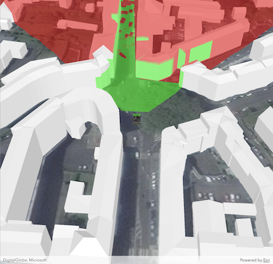

# Viewshed (GeoElement)

A viewshed shows the visible and obstructed areas from an observer's vantage point. This sample demonstrates how to attach a viewshed to a moving GeoElement.

## How to use the sample

Once the scene is done loading, click on a location for the tank to drive to. It will automatically turn and drive straight towards the clicked point. The viewshed will automatically move and rotate with the tank.

## How it works

To attach a viewshed to an <code>AGSGeoElement</code>:

<ol>
  <li>Create an <code>AGSGraphic</code> and add it to an <code>AGSGraphicsOverlay</code>.</li>
  <li>Use an <code>AGSSimpleRenderer</code> in the <code>AGSGraphicsOverlay</code> which has a heading expression set. This 
  way you can relate the viewshed's heading to the <code>AGSGeoElement</code>'s heading.
  <li>Create an <code>AGSGeoElementViewshed</code> with the graphic, heading/pitch offsets, and min/max distance.</li>
  <li>To offset the viewshed's observer location from the center of the graphic, set <code>viewshed.offsetX</code>, etc.</li>
</ol>

<h2>Features</h2>

<ul>
  <li>3D</li>
  <li>AGSAnalysisOverlay</li>
  <li>AGSArcGISTiledElevationSource</li>
  <li>AGSArcGISScene</li>
  <li>AGSArcGISSceneLayer</li>
  <li>AGSGeoElementViewshed</li>
  <li>AGSGraphic</li>
  <li>AGSSceneView</li>
</ul>

