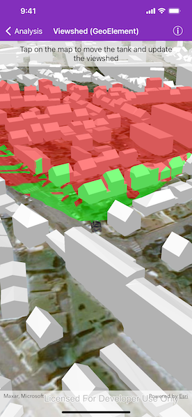

# Viewshed (GeoElement)

Analyze the viewshed for an object (geo element) in a scene.

## Use case

A viewshed analysis is a type of visual analysis you can perform on a scene. The viewshed aims to answer the question 'What can I see from a given location?'. The output is an overlay with two different colors - one representing the visible areas (green) and the other representing the obstructed areas (red).

## How to use the sample

Tap to set a destination for the vehicle (an  `AGSGeoElement`). The vehicle will 'drive' towards the tapped location. The viewshed analysis will update as the vehicle moves.

## How it works

1. Create and show the scene, with an elevation source and a buildings layer.
2. Add an `AGSModelSceneSymbol` (the GeoElement) to represent the observer (in this case, a tank).
    * Use an `AGSSimpleRenderer` which has a heading expression set in the `AGSRendererSceneProperties`. This way you can relate the viewshed's heading to the object's heading.
3. Create an `AGSGeoElementViewshed` with configuration for the viewshed analysis.
4. Add the viewshed to an `AGSAnalysisOverlay` and add the overlay to the scene.
5. Configure the SceneView `AGSCameraController` to orbit the vehicle.

## Offline data

[Model Marker Symbol Data](https://www.arcgis.com/home/item.html?id=07d62a792ab6496d9b772a24efea45d0) will be downloaded by the sample viewer automatically.

## About the data

This sample shows a [Johannesburg, South Africa Scene](https://www.arcgis.com/home/item.html?id=eb4dab9e61b24fe2919a0e6f7905321e) from ArcGIS Online. The sample uses a [Tank model scene symbol](https://www.arcgis.com/home/item.html?id=07d62a792ab6496d9b772a24efea45d0) hosted as an item on ArcGIS Online.

## Relevant API

* AGSAnalysisOverlay
* AGSGeodeticDistanceResult 
* AGSGeoElementViewshed
* AGSGeometryEngine.DistanceGeodetic (used to animate the vehicle)
* AGSModelSceneSymbol
* AGSOrbitGeoElementCameraController

## Tags

3D, analysis, buildings, model, scene, viewshed, visibility analysis
