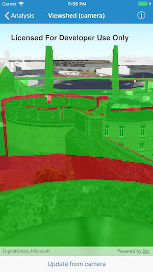

# Viewshed (camera)

This sample demonstrates how to create a location viewshed from a camera.

## How it works

The viewshed analysis object is created using the initializer of the `AGSLocationViewshed` called `init(camera:minDistance:maxDistance)`. The sample starts with a viewshed created from the initial camera location.

The output is displayed in an overlay representing the visible areas in green color and non-visible areas in red color. This is achieved by creating an `AGSAnalysisOverlay` for the viewshed and adding that overlay to a collection of analysis overlays in `AGSSceneView`.

When user clicks the button called `Update from camera`, the viewshed is updated with the current camera by calling the `update(from:)` method on `AGSLocationViewshed`. The current camera position is retrieved from the `currentViewpointCamera()` method on `AGSSceneView`.
